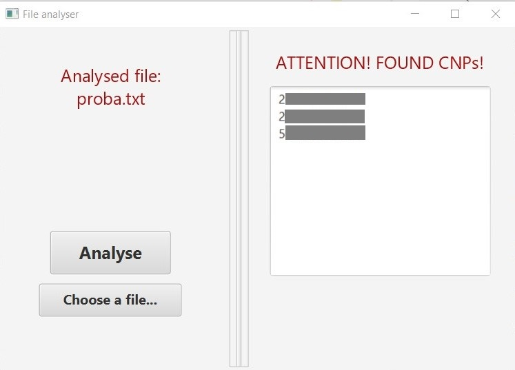
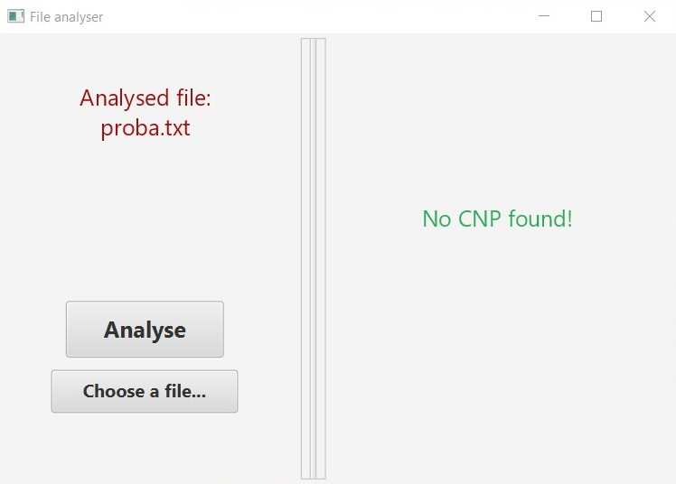

### CNP Analyser

Before writing the code for this application, I have searched on the
Internet to find more about the way the Romanian CNPs are created.
This is how I found that every digit, or group of digits in it has a 
certain significance. With that in mind, I first wrote a regular 
expression to consider all the rules imposed by each group of digits 
(_e.g._ the group AA (the second, and the third digit) stand for the last 
two digits of the birth year). The regular expression that I have used
is the following:

```java     
String CNP_REGEX =
      "[1-8]" + //gender
      "\\d{2}" + // year of birth
      "(02(0[1-9]|[12]\\d)" + // february (having only 28/29 days)
      "|(0[13578]|1[02])(0[1-9]|[12]\\d|3[01])" + //months having 31 days
      "|(0[469]|11(0[1-9]|[12]\\d|30)))" + //months having 30 days
      "(0\\d|[1-3]\\d|4[0-6]|5[12])" + //county code
      "\\d{2}[1-9]" + //secvential number
      "\\d"; //control digit
```
The analyser reads the file line by line, and based on the
regular expression for the Romanian CNPs checks if the
current line contains a matching sequence. Once a
matching sequence is found, a validation function checks if
the found sequence is a **valid Romanian CNP**, meaning that
it has to be compliant with the control digit (the last digit in
the CNP).

**The control digit (C)**, is the last digit in the CNP. The role of this digit 
is to assure that the CNP is a valid one. This check is done by using the 
special constant _279146358279_. 

_How is it used?_ Each of the first twelve digits in the CNP is multiplied 
by its corespondent in the special constant. Next, the sum of these products 
is computed, and then the total is divided by 11. If the remainder of this 
division is 10, the control digit C would be 1. Otherwise, the control 
digit would be the remainder itself.

The validation function that I have used for the control digit check is 
the following:
```java
    private Boolean controlDigitValidation(String cnp) {
        //control digit
        final int C = cnp.charAt(cnp.length() - 1) - '0'; 
        var sum = 0;
        String CONTROL_CONSTANT = "279146358279";
        for (var i = 0; i < CONTROL_CONSTANT.length(); i++) {
            sum += (cnp.charAt(i) - '0') * (CONTROL_CONSTANT.charAt(i) - '0');
        }
        
        int res = sum % 11;
        if (res == 10) res = 1;
        
        return res == C;
    }
```

The application was implemented in Java. It also has a plain user interface, 
for which I have used JavaFX.

The user clicks on the _**Choose a file...**_ button and 
selects a text file to be analysed. After choosing the file, 
one clicks on the _**Analyse**_ button, and the file is analysed.

If the file **contains any valid Romanian CNP**, a proper message is 
shown together with the identified CNPs:




Otherwise, a message saying 
**no CNP was found** is shown.



